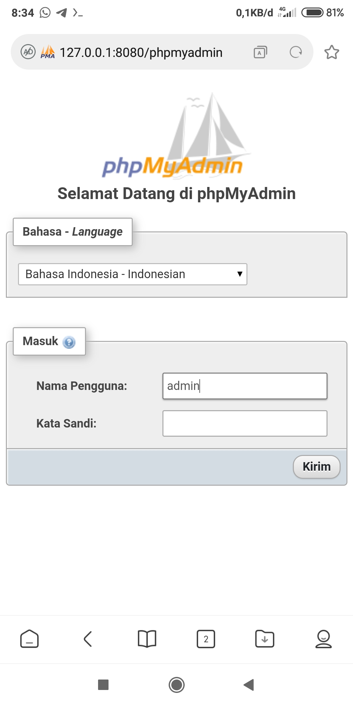

# lampp



Lampp adalah WebServer untuk Operating System Linux dan Android dengan Termux

Bagi yang ingin install webserver di android

# Syarat:
1. Termux app
2. Internet

# Panduan:

Buka aplikasi termux terlebih dahulu, setelah itu install paket yang dibutuhkan.
Untuk menginstal paket yang dibutuhkan gunakan perintah dibawah ini:

    $ apt update && apt upgrade
    $ apt install git -y

Dan masukan perintah dibawah ini:

    $ git clone https://github.com/apolbox/termux-webserver.git
    $ cd termux-webserver
    $ chmod +x ./install.sh
    $ ./install.sh

Tunggu sampai selesai dan untuk menjalankan webserver ketikan perintah berikut:

    $ lampp start --hosting-only

Untuk menjalankan database silahkan ikuti perintah dibawah ini:

    $ lampp start --database-only
    
Untuk menguninstall webserver masukan perintah berikut:

    $ chmod +x ./uninstall.sh
    $ ./uninstall.sh

# Fitur yang akan datang

* phpMyAdmin (release)
* mariadb (release)

# Fitur yang telah ditambahkan

* mariadb
* phpMyAdmin

# Update lampp server

Untuk melakukan update lampp server gunakan perintah berikut:

    $ chmod +x ./update.sh
    $ ./update.sh

Dan bagi yang sudah mendownload silahkan ikuti langkah berikut:

    $ wget https://raw.githubusercontent.com/apolbox/termux-webserver/master/update.sh
    $ chmod +x ./update.sh
    $ ./update.sh
    
Setelah update berhasil kini anda dapat menjalankan perintah berikut:

    $ lampp start --all
    
Ini akan menjalankan hosting dan database secara bersama.

# Direktori kerja

Direktori kerja anda berada di <code>/sdcard/htdocs</code>, mohon untuk mengecek penyimpanan internal anda, terima kasih.

# phpMyAdmin

Untuk membuka phpMyAdmin silahkan kunjungi <code>http://localhost:8080/phpmyadmin</code>,
dan untuk loginnya bisa dicoba dengan:

<ul>
  <li>username: root atau admin</li>
  <li>password: tidak perlu diisi</li>
</ul>

# Pembaruan

Jika kalian mengalami error saat mengakses phpmyadmin, kalian dapat mengikuti cari berikut ini :

1. Langkah pertama
```bash
$ mysql -u $(whoami)
```

2. Langkah kedua
```bash
MariaDB [(none)]> ALTER USER 'root'@'localhost' IDENTIFIED BY '';
MariaDB [(none)]> FLUSH PRIVILEGES;
MariaDB [(none)]> \q
```

3. Langkah ketiga
```bash
$ mysql -u root
```

Kalau berhasil terbuka jalankan perintah berikut:
```bash
$ bash update.sh
```

# catatan

Jangan lupa lihat <code>[mariadb_config.md](https://github.com/apolbox/termux-webserver/blob/master/mariadb_config.md)</code>

# Kontak kami

* facebook	: https://www.facebook.com/ayus.filla
* email		: ayus.sahabat@gmail.com
* whatsapp  : +628979320749
